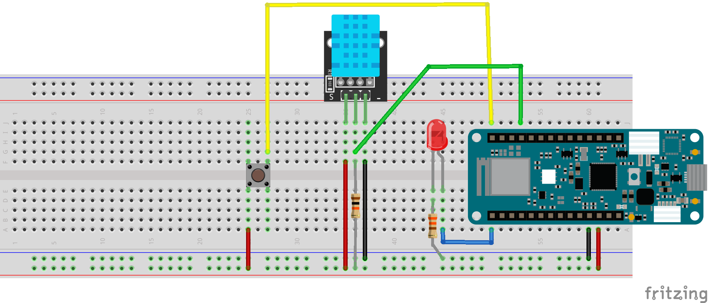
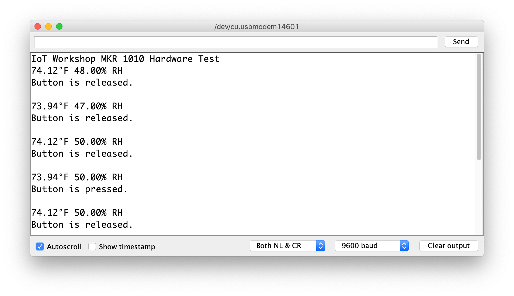
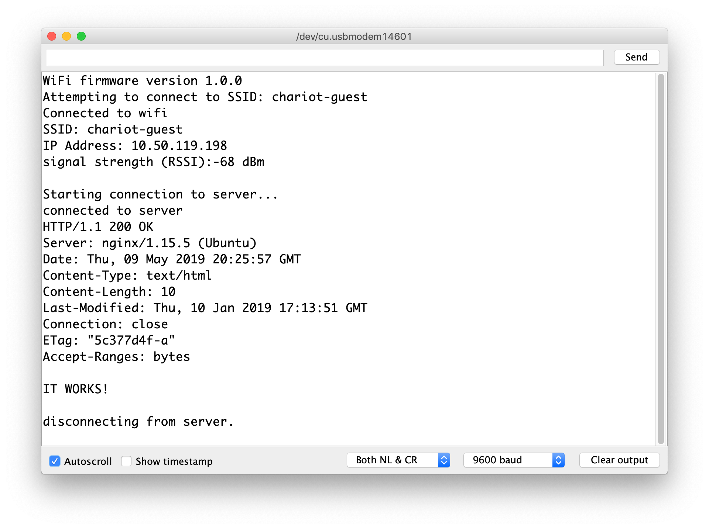

# Exercise 2: Assemble the Hardware

Use the parts in the kit and assemble the hardware.

## Wiring

Suggested wiring instructions:

1. Place the solderless breadboard with **A1 on the bottom left**.
1. Plug the Arduino MKR WiFi 1010 into the breadboard with the 5V pin in B63. (63 is the last column.)
1. Plug the LED into E44 and E45. Make sure the longer leg is in E45.
   * Run a 330 &#937; resistor (orange, orange, brown, gold) from the negative rail to D44.
   * Run a blue wire from A45 to A50 which is pin 6 on the Arduino.
1. Plug the DHT-11 into J35, J36, & J37.
   * Use a red wire from the positive rail to F35.
   * Put a 10,000 &#937; resistor (brown, black, orange, gold) from the positive rail to F36.
   * Place a black wire from the negative rail to F37.
   * Run a green wire from G36 to J53 which is pin 2 on the Arduino.
1. Place a button into E25, E27, F25, and F27 on the breadboard.
   * Use a red wire from the positive rail to A25.
   * Use a yellow wire from G27 to J50 which is pin 5 on the Arduino.
1. Run a black wire from A60 to the negative rail.
1. Run a red wire from the Arduino Vcc pin, A61, to the positive rail. The Vcc pin supplies 3.3 volts.

## Hardware Test

1. Open arduino/HardwareTest/HardwareTest.ino in the Arduino IDE
1. Choose the board _Tools -> Board -> Arduino MKR WiFi 1010_
1. Choose the port _Tools -> Port -> COM 3 (Arduino MKR WiFI 1010)_ Note that the actual port may be different on your computer
1. Upload the code to the board _Sketch -> Upload_
1. The LED should be a solid color
1. Open the serial monitor _Tools -> Serial Monitor_
1. The LED should start blinking and you should see temperature, humidity, CdS, button, & servo data in the serial console
1. To stop the program press the RST button on the board.
    * To restart the test, close the _Serial Monitor_ dialog and open it again.

## Network Test

1. Open arduino/NetworkTest/NetworkTest.ino in the Arduino IDE
1. Edit the ssid and password on the arduino_secrets.h tab
1. Upload the code to the board _Tools -> Upload_
1. Open the serial monitor _Tools -> Serial Monitor_
1. Look for the message "IT WORKS!"

Next [Exercise 3: Sending data using MQTT](exercise3.md)
