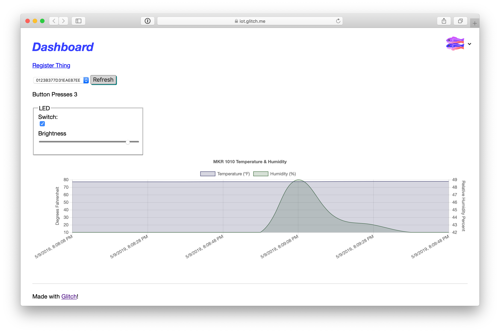
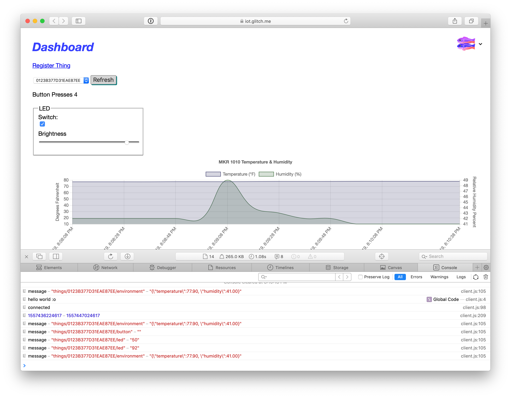

# Exercise 8: Running the Prototype

Now that then config has been setup in the preview exercise, we are ready to upload the AWS sketch on to our board.

1. Upload the code to the board _Sketch -> Upload_
1. Open the serial monitor to view status updates of what the sketch is doing.

    On boot the sketch configures the temperature sensor and LED, in a similiar way as the previous exercises. It also setups up the crypto element and along the certificate needed for the secure connection to AWS IoT Core. After this is complete it will attempt to connect to the local WiFi network and then once this is succesfully complete, it will attempt to connect to the AWS IoT MQTT broker.
1. Open https://iot.glitch.me/
1. Login with the username and password provided by the instructors.
1. Select your device in the drop down.

    

1. You will see a real-time graph of the environment data sent by the sketch. Every 10 seconds, sensor data is sent to the "things/*0123456789ABCDEF01*/environment" topic in JSON format. The cloud infrastructure saves this data to a database. The web page creates the graph with data from the database and then subscribes to the same topic appending new data to the graph as it arrives.

    

1. Use the checkbox or range slider to control the LED on your device. The program sends a  MQTT message to the "things/*0123456789ABCDEF01*/led" topic with a brightness value.

## Notes

### Viewing MQTT Messages

Incoming MQTT messages are written to the console. If you open the browser debug console, you can view them.

### Device Policies

The cloud infrastructure has been setup in a restrictive manner. AWS Core IoT has a policy applied to enforce the topics a device a device can access.

* If you try to change the device id to something that is different from the certificate's common name, the MQTT connection will be refused.
* If you try to publish or subscribe to topics outside "things/device*XX*/" the MQTT broker will disconnect the connection.

        /* Thing Policy */
        {
            "Version": "2012-10-17",
            "Statement": [
                {
                "Effect": "Allow",
                "Action": "iot:Connect",
                "Resource": "arn:aws:iot:us-west-2:661516571298:client/${iot:Certificate.Subject.CommonName}"
                },
                {
                "Effect": "Allow",
                "Action": "iot:Publish",
                "Resource": "arn:aws:iot:us-west-2:661516571298:topic/things/${iot:ClientId}/*"
                },
                {
                "Effect": "Allow",
                "Action": "iot:Subscribe",
                "Resource": "arn:aws:iot:us-west-2:661516571298:topicfilter/things/${iot:ClientId}/*"
                },
                {
                "Effect": "Allow",
                "Action": "iot:Receive",
                "Resource": "arn:aws:iot:us-west-2:661516571298:topic/things/${iot:ClientId}/*"
                }
            ]
        }

## Server Code

You can view the server code on Glitch https://glitch.com/edit/#!/itp-arduino-workshop

## Bonus

The device serial number is a great way to manage a large number of devices, but it doesn't generate a friendly device name. Try creating a new X.509 certificate with a different Common Name. Adjust the Arduino code so the device can still connect. Remember there is an AWS policy in place for our Core IoT implementation that requires the client id to match the common name in the certificate.